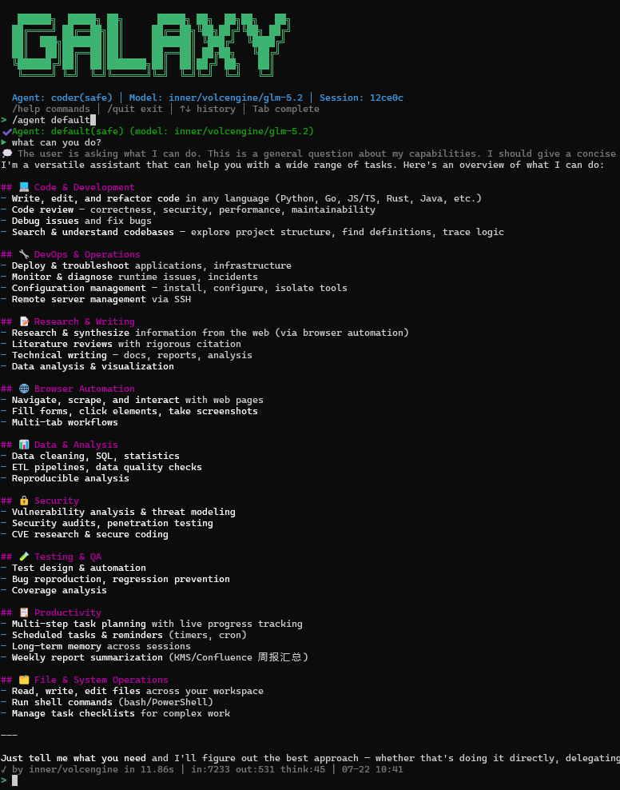

# GAL Release

[中文](README_CN.md)

**An LLM you can let loose.** One binary. CLI, GUI, and IM server. Linux, macOS, Windows. Zero install, kernel-level safe by default.



```bash
# Linux / macOS
./gal init && ./gal chat

# Windows GUI - double-click galw.exe, done.
```

---

## Why GAL

Agentic loops are table stakes now - plenty of tools let an LLM call tools and iterate until done. GAL's bet is on the parts those tools skip: **the same product across CLI, GUI, and IM, on Linux / macOS / Windows, with a kernel-enforced sandbox you can leave on in production - no Docker, no remote sandbox, no per-tool permission prompts.**

| Form factor | Binary | Install |
|-------------|--------|---------|
| Terminal / SSH | `gal` | copy file, run |
| Desktop GUI | `galw` | copy file, double-click |
| IM / HTTP server | `gal serve` | copy file, fill in tokens, run |

### Safe on real machines, not just toys

Kernel-level sandboxing, the same security model on every OS - Linux (private mount namespace + OverlayFS), macOS (Seatbelt), Windows (AppContainer). The LLM gets full productivity inside your project, and is blocked from corrupting your machine or exfiltrating secrets. Need to install a package or restart a service? `/sudo <msg>` grants exactly one turn of unrestricted access and snaps back automatically.

### Context that survives long sessions

Model-driven memory lets the LLM decide what to summarize and what to keep. Tens of thousands of agent rounds in one session, with the current turn always protected.

### Self-extending

- **Skills** - drop a `SKILL.md` + scripts into a folder, the LLM picks it up, the scripts become tools.
- **MCP** - connect any MCP server, the tools and resources appear automatically.

---

## Downloads

Each [Release](https://github.com/ai-agent-home/gal-release/releases) contains platform-specific archives. The binary inside each archive has a clean name (`gal` / `galw`) - platform info is encoded in the archive name only.

| Platform | CLI (`gal`) | GUI (`galw`) |
|----------|-------------|--------------|
| Linux amd64 | `gal-linux-amd64.tar.gz` | `galw-linux-amd64.tar.gz` |
| macOS amd64 (Intel) | `gal-darwin-amd64.tar.gz` | `galw-darwin-amd64.zip` |
| macOS arm64 (Apple Silicon) | `gal-darwin-arm64.tar.gz` | `galw-darwin-arm64.zip` |
| Windows amd64 | `gal-windows-amd64.zip` | `galw-windows-amd64.zip` |

### Quick start

```bash
# Linux / macOS
tar xzf gal-linux-amd64.tar.gz
chmod +x gal
./gal init && ./gal chat

# Windows
# Extract gal-windows-amd64.zip, double-click gal.exe
# GUI: double-click galw.exe
```

### Verify checksums

Each release includes a `checksums.txt`:

```bash
sha256sum -c checksums.txt --ignore-missing
```

---

## Issues & Feedback

- 🐛 **Bug reports**: [Open an issue](https://github.com/ai-agent-home/gal-release/issues/new?labels=bug)
- ✨ **Feature requests**: [Open an issue](https://github.com/ai-agent-home/gal-release/issues/new?labels=enhancement)
- 💬 **Discussions / Q&A**: [Start a discussion](https://github.com/ai-agent-home/gal-release/discussions)

You can also submit feedback via the [official website](https://agent-home.ai/feedback.html).

---

## Links

- [Official Website](https://agent-home.ai) - docs, download page, feedback
- [Releases](https://github.com/ai-agent-home/gal-release/releases) - all versions
